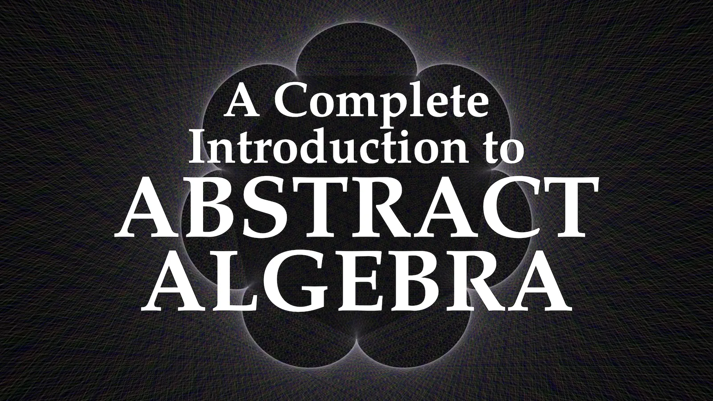

*Abstract Algebra* is a series of books on abstract algebra.

## Latest Release
You can find the latest release [on Overwrite](https://overwrite.site/projects/abstract-algebra), or on [GitHub](https://github.com/PhotonicGluon/Abstract-Algebra-Book/releases/latest).

## Licence
This work is released under a Creative Commons [Attribution-NonCommercial-ShareAlike 4.0 International Licence](LICENSE).
